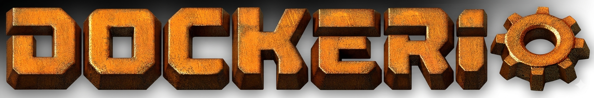

<p align="center">
  
</p>

<p align="center">
  <a href="https://github.com/g0su911/Dockerio/actions"></a>
  <a href="https://hub.docker.com/r/hideroot/dockerio"></a>
  <a href="https://hub.docker.com/r/hideroot/dockerio"></a>
  <a href="https://github.com/g0su911/Dockerio/blob/main/LICENSE"></a>
  <a href="https://github.com/g0su911/Dockerio/stargazers"></a>
</p>

<p align="center">
  <a href="README.ko.md">한국어</a>
</p>

# Dockerio

Run a Factorio headless server with Docker. Auto map reset, player monitoring, and achievement support out of the box.

## Features

- **Auto Map Reset** — Game time limit + scheduled resets
- **Player Monitoring** — Welcome messages for new players, playtime tracking for returning players
- **Achievement Safe** — No console commands or mods, achievements stay enabled
- **AFK Auto-Kick** — Default 30 minutes
- **Rich Text Tags** — Colors, icons, and fonts in server browser listing
- **Auto Version Update** — GitHub Actions checks for new Factorio versions every 6 hours
- **Countdown Timer** — 60s, 30s, 10-1s countdown before reset

## Quick Start

### 1. Clone

```bash
git clone https://github.com/g0su911/Dockerio.git
cd Dockerio
```

### 2. Install

```bash
./install.sh
```

The installer will guide you through:
- Factorio credentials (username + token)
- Server name / password
- Admin setup
- RCON password (auto-generated)

### 3. Get Your Factorio Token

1. Go to [https://factorio.com/profile](https://factorio.com/profile)
2. Log in with your Factorio account
3. Copy the **API authentication token** at the bottom of the page
4. Paste it when prompted by `install.sh`

> The token is required for your server to appear in the public server list.

### 4. Run

```bash
docker compose up -d
# or
docker-compose up -d
```

## Environment Variables

| Variable | Default | Description |
|----------|---------|-------------|
| `FACTORIO_RCON_PASSWORD` | `changeme` | RCON password |
| `FACTORIO_RCON_PORT` | `27015` | RCON port |
| `RESET_SCHEDULE` | `WED:06:00,FRI:19:00,MON:06:00` | Auto reset schedule (DAY:HH:MM) |
| `RESET_GAME_HOURS` | `30` | In-game hours before auto reset |
| `SERVER_MODE` | `achievement` | Server mode |

## Ports

| Port | Protocol | Description |
|------|----------|-------------|
| 34197 | UDP | Factorio game |
| 27015 | TCP | RCON |

## Config Files

| File | Description |
|------|-------------|
| `config/server-settings.json` | Server name, token, tags (generated by `install.sh`) |
| `config/server-settings.example.json` | Settings template |
| `config/map-gen-settings.json` | Map generation (resources, cliffs, planet settings) |
| `config/map-settings.json` | Game rules (pollution, biter evolution, etc.) |
| `config/server-adminlist.json` | Admin list (generated by `install.sh`) |

> `server-settings.json`, `server-adminlist.json`, and `.env` are in `.gitignore` and won't be committed.

## Scripts

### entrypoint.sh
Main server loop. Creates map, starts server, recreates map on exit and restarts.
Auto-updates "last reset" date in server tags after each reset.

### reset-monitor.sh
Runs in background, triggers reset on two conditions:
- **Game time limit**: When `RESET_GAME_HOURS` is exceeded
- **Scheduled reset**: At times set in `RESET_SCHEDULE`

Saves before reset, then counts down: 60s → 30s → 10 to 1s.

### player-monitor.sh
Watches `console.log` in real-time:
- **New players**: Welcome message + server uptime + achievement playtime info
- **Returning players**: Shows accumulated playtime
- **On leave**: Auto-saves session playtime

### manual-reset.sh
Admin-triggered manual reset:
```bash
docker exec dockerio-factorio-1 bash /opt/factorio/scripts/manual-reset.sh
```

## Server Commands (RCON)

```bash
# Server announcement (requires shout command setup)
shout "message"

# RCON commands
shout '/players o'          # List online players
shout '/time'               # Server uptime
shout '/evolution'          # Biter evolution factor
shout '/server-save'        # Manual save
```

## Customization

After running `install.sh`, edit config files directly. Restart the server after changes.

### Server Info

`config/server-settings.json`:
```json
{
  "name": "Server Name",
  "description": "Server description",
  "tags": ["Tags shown in server browser"],
  "game_password": "connection password"
}
```

**Rich text** (usable in tags):
```
[color=red]Red text[/color]
[font=default-bold]Bold[/font]
[font=heading-1]Large heading[/font]
[item=iron-plate]    ← Item icon
[entity=small-biter] ← Entity icon
```
Available colors: red, green, blue, orange, yellow, cyan, purple, gray

### Reset Schedule

In `docker-compose.yml`:
```yaml
environment:
  - RESET_SCHEDULE=WED:06:00,FRI:19:00,MON:06:00  # DAY:HH:MM (UTC)
  - RESET_GAME_HOURS=30                             # In-game hour limit
```

### Map Settings

Edit `config/map-gen-settings.json` to change resources, cliffs, biters:

```json
{
  "autoplace_controls": {
    "iron-ore": {"frequency": 6, "size": 6, "richness": 6}
  }
}
```

| Value | In-Game Display |
|-------|----------------|
| 1     | 100% (default) |
| 2     | 150% |
| 3     | 200% |
| 5     | 400% |
| 6     | 500% (max) |

**Disable cliffs:**
```json
{
  "nauvis_cliff": {"frequency": 0, "size": 0, "richness": 0},
  "gleba_cliff": {"frequency": 0, "size": 0, "richness": 0},
  "fulgora_cliff": {"frequency": 0, "size": 0, "richness": 0}
}
```

**Planet-specific resource keys:**
| Planet | Keys |
|--------|------|
| Nauvis | `coal`, `stone`, `iron-ore`, `copper-ore`, `uranium-ore`, `crude-oil` |
| Vulcanus | `vulcanus_coal`, `calcite`, `sulfuric_acid_geyser`, `tungsten_ore` |
| Gleba | `gleba_stone` |
| Fulgora | `scrap`, `lithium_brine` |
| Aquilo | `aquilo_crude_oil`, `fluorine_vent` |

See `docs/map-gen-reference.md` for full details.

### Adding Admins

`config/server-adminlist.json`:
```json
["admin_username1", "admin_username2"]
```

## Auto Version Update

GitHub Actions checks for the latest Factorio stable version every 6 hours.
New version detected → Docker build → Docker Hub push → auto-deploy to server.

## License

MIT
